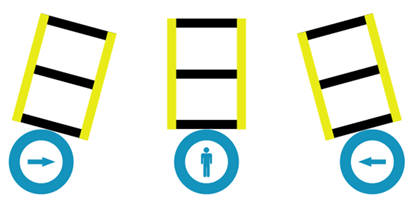
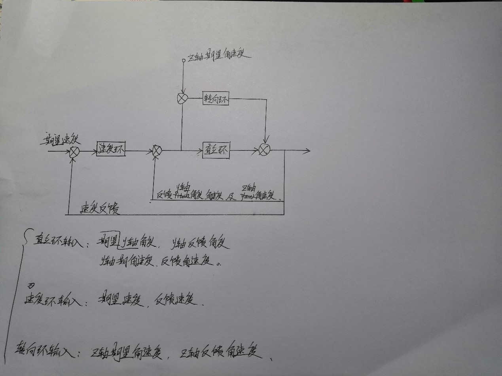

---
html:
  toc: true
---
# 平衡小车视频学习笔记（based on 天下行走）
version: V1.0
学习者：Frank Zheng
最后编辑日期：2022年10月16日

---
## 前期准备
- 哔哩哔哩视频：[平衡小车在线编程课程视频（1~3节合集版本）（2月12日更新）](https://www.bilibili.com/video/BV1j7411z7uX/?spm_id_from=333.999.0.0&vd_source=94c2b3982ce2b4282277f532d1dd68c0)
- 软件开发环境：keil MDK5 以及 STM32F1 pack，采用标准库进行编程。
- 材料清单：丰俭由人，视频里提供的只是一个参考的硬件开发环境。Up依托的硬件环境为：
  - 大鱼电子的平衡小车系统板
  - 大鱼电子平衡小车电机和底盘
  - 航模3s电池
- 知识基础：Up主在P1中声明本套视频的食用基础为  学过STM32微控制器，包括但不限于<u>**GPIO、PWM、定时器、外部中断、编码器接口以及IIC接口**</u>等外设。如果在没有一两次以上STM32外设编程经历的情况，在学习本套视频中会遇到多一些困难，但依旧可以进行学习。

## 如何使用本文档
&ensp;&ensp;本文档的编写平台基于VSCode中的Markdown。蓝色字体均带有对应的视频链接。可直接点击并跳转。
&ensp;&ensp;本文档仅用于视频学习记录，视频Up主在讲解过程中会出现漏打代码，但是视频的后边又补上的情况。之所以还能补上的原因在于，up主是按照一定顺序流程，边打边编译，并烧录观察效果。
&ensp;&ensp;本文档将会记录这些及时勘误的视频时间节点，以便于之后回顾。本文档将会遵循up主视频讲解顺序进行记录，试着在功能代码部分指出Up主对其勘误的视频时间节点。如果积累过一些问答，也一并在相应的部分进行合并。
&ensp;&ensp;另外，看Up主写代码是一个很享受的过程。

---
## 正文开始
## [P1 第1.1节 课程框架&前期工作](https://www.bilibili.com/video/BV1j7411z7uX?p=1)
&ensp;&ensp;在本集视频中，up主使用的word文档为up主自己编写的文字材料。在qq群中路径为群文件路径“<u>平衡小车\平衡小车--葛凤佩(2020.02.23更新).rar</u>”
&ensp;&ensp;up主声明本套视频的食用基础在本文档中的“前期准备”一栏已经著名，不再重复指出。
&ensp;&ensp;本套视频的内容编排如下：
1. 第一部分为根据本次平衡小车的实际硬件情况进行STM32外设的程序配置。
2. 第二部分PID控制（位置式PID）的理论介绍，其中包括直立环、速度环、转向环等内容，以及平衡小车的控制理论和控制过程的编程。
3. 第三部分为PID的系数调参。有些文章会说是参数整定。

### 编程环境搭建
1.  MPU6050的函数文件采用正点原子的MPU6050的移植文件。（正点原子为售卖STM32开发板的品牌名，淘宝有店铺）
  另外：Up主写过几篇对MPU6050的理解，
  - [平衡小车中的MPU6050是如何测量倾角的？ - 天下行走的文章 - 知乎](https://zhuanlan.zhihu.com/p/84925247)
  - [MPU6050的使用和一些理解 - 天下行走的文章 - 知乎](https://zhuanlan.zhihu.com/p/89592536)
  - [MPU6050的使用和一些理解（二） - 天下行走的文章 - 知乎](https://zhuanlan.zhihu.com/p/89596474)


2.  OLED屏幕的函数文件采用中景园的文件。（中景园为淘宝的一家卖OLED屏幕的店铺）
3.  SYSTEM 文件夹采用正点原子的文件。（直接移植）
   接下来就是工程文件的搭建，都是做一些前期准备工作，直接继续看视频。

## [P2 第1.2节 基本外设的程序配置](https://www.bilibili.com/video/BV1j7411z7uX?p=2)
&ensp;&ensp;检查：先把在P1视频中所提到的文件的.h头文件的路径给加上。

### encoder.c 编码器函数编程
1. #### 第一次编写

  视频时间点：第1.2节：基本外设的程序配置 P2 - [06:57](https://www.bilibili.com/video/BV1j7411z7uX/?note=&p=2&t=416&vd_source=94c2b3982ce2b4282277f532d1dd68c0#:~:text=%E7%A8%8B%E5%BA%8F%E9%85%8D%E7%BD%AE%20P2%20%2D-,06%3A48,-%E7%BC%96%E7%A0%81%E5%99%A8%E5%87%BD%E6%95%B0)

  外设资源分配： 
  | 编码器    | MCU编码器通道管脚 |对应定时器资源   |
  | :----:    |    :----:        |     :---:      |
  | 编码器1   | PA0、PA1         | TIM2           |          
  | 编码器2   | PB6、PB7         | TIM4           |

  代码内容编写过程：
  初始化：
  - GPIO初始化
  - 定时器初始化
  - 设置编码器模式
  - 清除定时器溢出更新标志位
  - 中断配置
  - 清零编码器计数Counter
  - 开定时器
  
  【编程技能1 批量修改某个变量的操作】
  视频时间点：第1.2节：基本外设的程序配置 P2 - [21:23](https://www.bilibili.com/video/BV1j7411z7uX/?p=2&vd_source=94c2b3982ce2b4282277f532d1dd68c0&t=1283) 
  - 批量修改的操作，Ctrl+双击，选中自己要更改的变量，然后删掉原来的。以及开始输入新的变量。

  **编码器读取函数（读取的是速度）编写中注意事项：**
  视频时间点：第1.2节：基本外设的程序配置 P2 - [25:14](https://www.bilibili.com/video/BV1j7411z7uX/?p=2&vd_source=94c2b3982ce2b4282277f532d1dd68c0&t=1513.2)
  
  ```c
  /**********************
  编码器速度读取函数
  入口参数：定时器
  **********************/
  int Read_Speed(int TIMx)
  {
    int value_1;
    switch(TIMx)
    {
      case 2:value_1=(short)TIM_GetCounter(TIM2);TIM_SetCounter(TIM2,0);break;
      //IF是定时器2，1.采集编码器的计数值并保存。2.将定时器的计数值清零。
      case 4:value_1=(short)TIM_GetCounter(TIM4);TIM_SetCounter(TIM4,0);break;
      default:value_1=0;
    }
    return value_1;
  }
  ```
  之所以在`TIM_GetCounter`前边加上`(short)`进行强制类型转换的原因是`TIM_GetCounter`函数本身读回的是`uint16_t`数据类型，实际上也就是`unsigned short int`，而`value_1`的数据类型是`int`。所以两个数据变量不一样，要做点强制转换。
 
2. #### 提问 Encoder.c 编码器函数编程
 【提问1】问题来了，为什么不是强制转换成`int`？我尝试转换成`int`,也没报错。
  | value_1 数据类型 |TIM_GetCounter 数据类型| 
  | :----:          |     :---:             |
  | int             | unsigned short int    |  

  回答：        
  我在网上找到这样一篇文章： [C语言的三种整型数据类型：int、short int和long int](https://blog.csdn.net/NoteFAN/article/details/38849555)
  里边介绍了一下三种数据类型的简写以及数据范围。

  |名称	|全称类型说明符	|缩写类型说明符|位数   |范围 |
  | :----:|   :---:    | :---:         | :---:   | :---:   |
  |  整型       |int	|int	|16位   |  	-32768至+32767 |
  |  无符号整型    |	unsigned int       |	unsigned	    |16位	    |0 至 65,535 |
  |  短整型        |  short int 	       |  short          |	16位	|-32768至+32767 |
  |  无符号短整型  |  unsigned short int | 	unsigned short |16位	  |0 至 65,535 |
  |  长整型        |  long int 	         |   long	        |32位    |-2,147,483,648 至 2,147,483,647 |
  |  无符号长整型  |  unsigned long int  | 	unsigned long  | 	32位  |	0至4,294,967,295  | 

  个人理解是由于`int`和`short int`（简写为`short`）的位数和数据范围都一样，所以在Up主敲的也不会有报错。

  【提问2】为什么不是直接把`Read_Speed`读取函数定义成`TIM_GetCounter`函数一样的数据类型呢？
  回答：我个人觉得是这样的解释的，从当前值，正转加1，反转减1。每次测量完都把定时器计数值清零，正转就是1、2、3、4。反转就是从0向下减，加short强制转化成-1、-2、-3。（抄群里的一个回答，等待仔细琢磨）
  
  【提问3】那么编码器模式用到了中断服务函数，要不要开启定时器中断优先级？
  回答：在Up主接下来的内容里就回答到了这个问题。视频时间点：第1.2节：基本外设的程序配置 P2 - [25:44](https://www.bilibili.com/video/BV1j7411z7uX/?p=2&vd_source=94c2b3982ce2b4282277f532d1dd68c0&t=1544.4)
  好像是在说，虽然我们用不到中断服务函数，我们只是用定时器用来做计数，但是这里添加中断服务函数的原因只是为了能够寻址到编码器初始化函数。
  这里没听清，等有时间再找资料。
  
  【提问4】Read_Speed(int TIMx)函数如何体现是读取速度的？因为读回的是编码器的值而已。
  回答：Up主在视频中回答到了这个问题。视频时间点：第1.2节：基本外设的程序配置 P2 - [32:36](
  https://www.bilibili.com/video/BV1j7411z7uX/?p=2&vd_source=94c2b3982ce2b4282277f532d1dd68c0&t=1956.4) 
  因为每次读取编码器值的时候，`TIM_SetCounter(TIM2,0)`以及`TIM_SetCounter(TIM4,0)`都会清零一遍计数值。速度是对位移在时间上的求导。当你每隔一段时间就读取这个编码器的计数值，并且每次读取完的时候清零计数值，就相当于每次都读取的编码器计数值和上一次读取的计数值是无关的。简化理解就是一段时间内读取到的位移变化量是速度，那么每一段时间开始的位移值是从0开始的，在时间末尾读取的位移值，也就能直接求得速度。


### pwm.c PWM函数编程
1. #### 第一次编写
视频时间点：第1.2节：基本外设的程序配置 P2 - [36:45](https://www.bilibili.com/video/BV1j7411z7uX/?p=2&vd_source=94c2b3982ce2b4282277f532d1dd68c0&t=2205.3)

  外设资源分配： 
  | PWM    | MCU编码器通道管脚 |对应定时器资源   |
  | :----: |    :----:        |     :---:      |
  | PWM1   | PA8              | TIM1           |          
  | PWM2   | PA11             | TIM1           |


  代码内容编写过程：
  - GPIO初始化
  - 定时器初始化
  - 输出比较模式初始化
  - MOE主输出使能
  - 通道预装载使能
  - 使能定时器在ARR寄存器上的预装载寄存器

2. #### 勘误
  - 对复用的补充在以下时间节点:
    视频时间点：第1.2节：基本外设的程序配置 P2 - [52:14](https://www.bilibili.com/video/BV1j7411z7uX/?p=2&vd_source=94c2b3982ce2b4282277f532d1dd68c0&t=3134.3)
    至于为什么需要开启复用时钟,在视频弹幕里各说纷纭。
    参考了一篇 CSDN:**[关于stm32中引脚的复用，重映射问题](https://blog.csdn.net/weixin_47042449/article/details/122458913?spm=1001.2101.3001.6650.10)** 之后,其中文章末尾给出了方向:
    那些情况需要开启AFIO辅助功能时钟？
    ``` text
    对寄存器AFIO_MAPR，AFIO_EXTICRX和AFIO_EVCR进行读写操作前，应当首先打开AFIO时钟。
    - FIO_MAPR：配置复用功能重映射
    - AFIO_EXTICRX：配置外部中断线映射
    - AFIO_EVCR：配置EVENTOUT事件输出
    ```
    &ensp;&ensp;所以,根据该博文，Up主在这里添加开启复用时钟的做法应该是可以不用添加的。Up主在群文件的探讨附件里，也介绍了这些：
    ```text
    问：讲解pwm配置的时候，开启了AFIO时钟，但是AFIO时钟只有三种情况需要开启，分别是外部中断、重映射、EVENTOUT，所以我有点疑惑
    问：请问下为什么PWM也需要开启RCC_APB2Periph_AFIO时钟，我之前写过的程序没打开这个时钟也可以输出pwm呀

    答：复用是第二功能，比如PWM时用“复用推挽输出”而不能“推挽输出”。
    重映射是：重新映射第二功能，该功能原本正常复用这个io，现在重新映射到另一个IO上。
    即一个功能对应多个IO，防止其中一个被其他功能占用而无法使用本功能。
    如果PWM使用了部分重映射或者满重映射，才用的着开复用时钟，所以视频里AFIO时钟可以不开。
    程序里没有用到部分或者满重映射，当时开复用时钟应该是预防后期再去重映射，提前写了。
    ```

  - 第二个处修正在 第2.1节：串级PID理论&公式&编码器函数讲解（2月12日重新上传版本） P3 - [01：18](https://www.bilibili.com/video/BV1j7411z7uX/?p=3&vd_source=94c2b3982ce2b4282277f532d1dd68c0&t=68.9)
    把正确的定时器改上，`TIM2`改成`TIM1`。
  - 第三处修正 紧跟上一个修正后边，
    ```c
    TIM_OC1PreloadConfig(TIM1,TIM_OCPreload_Enable);/*【3】*///在1.2节时写成了 ENABLE//OC1预装载寄存器使能
    TIM_OC4PreloadConfig(TIM1,TIM_OCPreload_Enable);//在1.2节时写成了 ENABLE//OC4预装载寄存器使能
    ```


### exti.c 外部中断函数编程
1. #### 第一次编写
视频时间点：第1.2节：基本外设的程序配置 P2 - [48:12](https://www.bilibili.com/video/BV1j7411z7uX/?p=2&vd_source=94c2b3982ce2b4282277f532d1dd68c0&t=2892.5)

  外设资源分配： 
  | MPU6050    | MCU编码器通道管脚 |
  | :----:     |    :----:        |  
  | 中断引脚    | PB5,使用外部中断 |   
2. #### 勘误    
    对外部中断功能的GPIO工作模式 的第一次修正： 视频时间点：第1.2节：基本外设的程序配置 P2 - [55:54](https://www.bilibili.com/video/BV1j7411z7uX/?p=2&vd_source=94c2b3982ce2b4282277f532d1dd68c0&t=3353.7)
    从`GPIO_Mode_Out_PP`改成`GPIO_Mode_AF_PP`。
    **但是**，再次修正在 再次修正在第2.1节：串级PID理论&公式&编码器函数讲解（2月12日重新上传版本） P3 - [00:22](https://www.bilibili.com/video/BV1j7411z7uX/?p=3&vd_source=94c2b3982ce2b4282277f532d1dd68c0&t=22.7)
    从`GPIO_Mode_AF_PP`改成`GPIO_Mode_IPU`。

### motor.c 编码器函数编程
视频时间点：第1.2节：基本外设的程序配置 P2 - [54:19](https://www.bilibili.com/video/BV1j7411z7uX/?p=2&vd_source=94c2b3982ce2b4282277f532d1dd68c0&t=3259.1)
1. #### 第一次编写
   外设资源分配：
    | 电机    | MCU编码器通道管脚 |
    | :----:  |    :----:        |  
    | 电机1   | PB12，PB13       | 
    | 电机2   | PB14，PB15       | 

  ```c
  int PWM_MAX=7200,PWM_MIN=-7200;	  //PWM限幅变量
  int MOTO1,MOTO2;                  //电机装载变量

  /*限幅函数*/
  void Limit(int *motoA,int *motoB)
  {
    if(*motoA>PWM_MAX)*motoA=PWM_MAX;
    if(*motoA<PWM_MIN)*motoA=PWM_MIN;
    
    if(*motoB>PWM_MAX)*motoB=PWM_MAX;
    if(*motoB<PWM_MIN)*motoB=PWM_MIN;
  }
  ```
  之所以是限幅做7200，这个是根据定时器的配置结果来决定的，那为什么是`PWM_MIN` 是-7200？在 `Load(int moto1,int moto2)`函数中有解释，负值代表它是反转。


2. ##### 勘误

    修正在 第2.1节：串级PID理论&公式&编码器函数讲解（2月12日重新上传版本） P3 - [01:58](https://www.bilibili.com/video/BV1j7411z7uX/?p=3&vd_source=94c2b3982ce2b4282277f532d1dd68c0&t=118.3)
    把函数声明加上，并修改了电机对应的管脚。


## [P3 第2.1节：串级PID理论&公式&编码器函数讲解（2月12日重新上传版本）](https://www.bilibili.com/video/BV1j7411z7uX?p=3)
  视频的开头进行了一些对上一集视频的勘误以及对STM32编码器功能的基本介绍。

### PID控制介绍
  视频时间节点： 第2.1节：串级PID理论&公式&编码器函数讲解（2月12日重新上传版本） P3 - [12:37](https://www.bilibili.com/video/BV1j7411z7uX?p=3&t=757.8)
  Up主说网上有很多对PID的知识普及类的文章，也可以看他自己的知乎文章
  天下行走:
  - [PID控制器 - 天下行走的文章 - 知乎](https://zhuanlan.zhihu.com/p/84767869)
  - [PID调参之“慢慢来，会很快” - 天下行走的文章 - 知乎](https://zhuanlan.zhihu.com/p/85020348)

  假设你没有控制理论的基础知识，且被禁止使用Matlab，但看完以下的视频，希望你依旧可以从中学到关于PID的控制知识。但一切都要结合实践去理解。可以试着用大量的输入和对原理重复阐述能够get点精华，用于消除对知识的恐惧。

  [【自动控制原理】6_比例积分控制器_PI控制](https://www.bilibili.com/video/BV1pJ411g7YZ/?spm_id_from=333.999.0.0&vd_source=94c2b3982ce2b4282277f532d1dd68c0)
  [【自动控制原理】12_PID控制器_Matlab/Simulink仿真【开场三分钟闲话】](【自动控制原理】12_PID控制器_Matlab/Simulink仿真【开场三分钟闲话】)
  [【Brian Douglas】PID控制](https://www.bilibili.com/video/BV1Ko4y1R7J9/?spm_id_from=333.337.search-card.all.click&vd_source=94c2b3982ce2b4282277f532d1dd68c0)


  在很多PID的文章中，都是先从模拟的，连续的环境中进行推导和介绍。最后落实到数字控制器中的离散化公式。
  其中，在本次平衡小车中，模拟的积分在数字离散化中用累加求和的方式。模拟的微分在数字离散化中用（本次偏差-上次偏差）/时间。

  **在PID中，或者其他基于负反馈的控制环节，要注意的是输入的参数是与目标值做差的误差值。**

  视频对这些的讲解讲得很好了，没有很多要补充的地方。（我似乎也受到了即知的魔咒，一旦知道了，就会忘记不知道的时候的感觉）

  视频弹幕里指出了一些错误，在此做一些记录。
  在[32:23](https://www.bilibili.com/video/BV1j7411z7uX/?p=3&t=1943.1&vd_source=94c2b3982ce2b4282277f532d1dd68c0)处，Up主敲的是 $Ki=Kp*(1/Ti) *Ti$
  正确的应该是 $Ki=Kp*(1/Ti) *T$

  以下是一些视频笔记：
  在本次平衡小车中，要用到三种PID。
  - 直立环，用的PD控制。直立环：让小车角度趋近0；
  - 速度环，用串级PID。速度环：让电机速度趋近0；[50:44](https://www.bilibili.com/video/BV1j7411z7uX/?p=3&t=3042.5&vd_source=94c2b3982ce2b4282277f532d1dd68c0)
    之所以需要速度环，是因为直立环只保证了小车能够直立，但没有保证它静止不动。小车立起来之后，那就自然会有向左移动和向右移动的趋势，因为电机的移动速度不受控。如果加上速度环配合直立环一起工作，那么就可以让小车在直立起来的同时，还能够防止小车左右移动。
  - 转向环

### 串级控制系统
  
  视频解释这个框图的时间节点：[51:47](https://www.bilibili.com/video/BV1j7411z7uX/?p=3&t=3107.9&vd_source=94c2b3982ce2b4282277f532d1dd68c0)

  在没有仔细琢磨过这个框图的时候或者没有自动控制原理的学习背景的时候，看这些图的时候是多少有点懵逼的。
  所以，先回到直立环单环控制的时候，小车是一个怎么样子的状态。
  下图分别为小车直立状态调整的框图。
  
  

  以上两个图，Up在视频前边讲直立环的时候已经讲的很清楚了，这里只是用于回顾。值得补充的是，这里的角度、角速度信息反馈是基于MPU6050，而在速度环的速度反馈是基于电机的编码器。

  以下是粗略的个人理解：
  MPU6050在小车的平面台上，用来检测平台的水平度。如果平台向左倾斜，那么小车的重心是左倾的，为了调整回小车的重心，可以有两个方向切入，第一个是小车轮子与地面的接触点不动，靠电机强大的扭力给扳直。第二种是靠轮子的移动，使得小车的重心再次和轮子与地面的接触点保持同一竖线上。

  这里用的是第二种方法，但是为什么不能用第一种呢？因为当电机扭动的时候，轮子必然受到来自地面的摩擦力，如果扭动很大，那么轮子必然是移动的。除非把接触点焊死，那么用单环估计应该就行了。

  所以，回顾到速度环上的讲解，我们已经知道首先保持小车能够直立起来的控制环是直立环，现在我们已经能够让小车直立起来，但是它必然会开始左右摇晃。那为了限制小车的移动速度保持为0。引入速度环进行控制。

  我在网上也找到过一篇博文是这么解释为什么要加入速度环的？仅供回顾理解。[原文地址](https://blog.csdn.net/mayuxin1314/article/details/125114464)
  （1）假设车模在上面直立控制调节下已经能够保持平衡了，但是由于安装误差，传感器实际测量的角度与车模角度有偏差，因此车模实际不是保持与地面垂直，而是存在一个倾角。在重力的作用下，车模就会朝倾斜的方向加速前进。如果没有速度调节是难以维持0速度的
  （2）对于直立车模速度的控制相对于普通车模的速度控制则比较复杂。由于在速度控制过程中需要始终保持车模的平衡，因此车模速度控制不能够直接通过改变电机转速来实现。也是需要通过PID速度调节来实现
  

  那么，要解释第二个疑问，为什么要把速度环加在直立环外边？我暂时还没有想到合适的解释，先放着，之后有时间再填坑。

  
  速度环输入：1.给定速度。2.速度反馈。
  输出：角度值（直立环的期望速度输入）

  直立环输入：1.给定角度（速度环输出）。2.角度反馈
  输出：PWM（直接控制小车）

  说到这里，曾经有人提到量纲的问题，角度的量纲和速度的量纲之类冲突的。我暂时忘了具体的问题是什么。但是暂时先不纠结。先做，做完之后再思考这几个比较深的问题或许会好一点。

  以下是在别的Up主评论区摘录的一些文段：
  [直立环pd速度环pi，很多人理解的内外环和程序里的内外环都很混乱，我只能告诉你，速度环的输出给了直立环，程序里直立环是外环，pid理论图里，串联之后直立环是内环。](https://www.bilibili.com/video/BV1fR4y1R7bf/?spm_id_from=333.1007.top_right_bar_window_history.content.click&vd_source=94c2b3982ce2b4282277f532d1dd68c0)

  以下是Up主写的一些公式，在此摘抄一遍。
  直立PD控制公式如下：
  $Vertical\_out=Kp1*( real\_Angle - expect\_Angle)+Kd*D( real\_Angle- expect\_Angle)$器		 
 
  速度PI控制公式如下,这里的S是sum 的意思，也就是累计求和。
  $Velocity\_out =Kp2*(Encoder\_real- Encoder\_expect)+Ki*S(Encoder\_real- Encoder\_expect)$ 

  NOTE：
  （1）$Velocity\_out$ = $expect\_Angle$.
  （2）$Kp1：Vertical\_Kp$.
  （3）$Kp2：Velocity\_Kp.$

  【中文】
  直立环输出=Kp1*（真实角度-期望角度+机械中值）+Kd* 角度偏差的微分	 //也就是角度偏差=真实角度-期望角度
  速度环输出=Kp2*（反馈编码器值-期望编码器值）+Ki* 编码器偏差的积分 //编码器偏差=反馈编码器值-期望编码器值
  NOTE：
  （1）速度环输出=直立环的期望角度。
  （2）Kp1：直立环Kp。
  （3）Kp2：速度环Kp。

  接下来就合并推导：
### 合并推导

  直立环输出：$Vertical\_out=Kp1*(θ_r-θ_e)+Kd* (θ_r-θ_e)＇$
  速度环输出：$Velocity\_out=Kp2*(E_r- E_e)+Ki*Σ(E_r- E_e)$
  因为：$θ_e	=	Velocity\_out$
  所以直立环输出: 
  $Vertical\_out$
  $= Kp1*{ θ_r-[ Kp2*(E_r- E_e)+Ki*Σ(E_r- E_e) ]}+Kd*(θ_r-θ_e)＇$
  $= Kp1* θ_r- Kp1* Kp2*(E_r- E_e)- Kp1*Ki *Σ(E_r- E_e) +Kd*(θ_r-θ_e)＇$
  $= Kp1* θ_r+ Kd*(θ_r-θ_e)＇-	Kp1* [Kp2*(E_r- E_e)+ Ki *Σ(E_r- E_e)]$
  
  【中文】
  =Kp1* 真实角度+ Kd* 角度偏差的微分-Kp1* [Kp2*编码器偏差- Ki *编码器偏差的积分]

  即：
  串级输出OUT=
  $Kp1* real\_Angle +Kd* D( real\_Angle- expect\_Angle)$
  —
  $Kp1*[Kp2*(Encoder\_ real- Encoder\_ expect)+Ki* S(Encoder\_ real- Encoder\_ expect)]	$


## [第2.2节：串级PID在线编程（2月12日重新上传版本）](https://www.bilibili.com/video/BV1j7411z7uX?p=4)

  - 控制函数写在外部中断服务函数里面。
  - 10ms控制周期由MPU6050的INT引脚给定。保证数据的采集和处理的同步性。
  需要修改的地方是在mpu6050.c 以及 inv_mpu.h

  ```c
  mpu6050.c 
  MPU_Set_Rate(100);	//设置采样率为10Hz
  ```
  ```c
  inv_mpu.h
  //定义输出速度
  #define DEFAULT_MPU_HZ  (100)		//10ms
  ```

  编程部分没啥问题，自己跟着敲，或者看着Up主的编写思路一直go就行。(实际上是因为我懒)
  搬运一下Up主在评论区的东西。免得看视频的时候产生疑问.
  ```text
  2.2节视频须知：
  第2.2节控制函数视频编程上出现以下问题，这些问题在3.1节开头已一一声明并在线改正。
  （本条评论一定要看！）

  【NOTE 1】
  直立环：比例项应该是：“Kp*真实角度”。
  视频里起初我故意写成了“Kp*偏差”，准备视频最后改掉并说明为什么改掉，结果最后忘记了。
  【NOTE 2】
  速度环里的低通滤波器参数初值a=0.7，视频里忘记赋初值。
  【NOTE 3】
  速度环：对偏差低通之后，再遇到需要操作“偏差”的部分，都要转去操作“低通后的偏差”。
  故后面的“求位移”以及“最终的速度环输出计算”都应该操作“低通后的偏差”。
  视频中先写的“位移计算”和“最终输出计算”，最后写的低通。忘记改过来。
  【NOTE 4】
  低通滤波器的上次输出变量不可常规定义，应该静态定义，即“static int EnC_Err_Lowout_last;”，
  因为我们要保存住上次的低通滤波器的输出，就必须定义为静态变量，或者全局变量。

  —————————————————————————————
  这条消息在散装视频里很早就声明了，但最近发现大家对合集版本关注度更高，
  2.2节视频是课程的核心。我担心有些同学只看了第2.2节没有继续往下看，
  忽略了视频里起初出现的错误，这会使得本视频带偏一些同学。故发声明，请各位同学一定要看！！！

  （此条别沉，顶一下）
  ```

  [15:05](https://www.bilibili.com/video/BV1j7411z7uX?p=4&vd_source=94c2b3982ce2b4282277f532d1dd68c0&t=905.4) 先从一般的计算式开始解释了读取的速度为什么是要“（左+右）/2”，然后做了优化。由于做“（左+右）/2”处理过程中，1）除法占用资源；2）数据类型的限制使得先加后除的计算结果导致了末尾数据的丢弃增加了 单片机计算上的误差。

  [16:59](https://www.bilibili.com/video/BV1j7411z7uX?p=4&vd_source=94c2b3982ce2b4282277f532d1dd68c0&t=1019.7) 因为速度环对直立环是一个干扰，所以Encoder_Err 和 Encoder_S 之间要做一个低通滤波器
  • 一阶低通滤波器算法实现 参考资料来自 https://blog.csdn.net/tuxinbang1989/article/details/80239232


  本车：直立环为主，速度环为辅助
  31：30  电机是相对安装的，为了编码器输出极性一致，就需要对其中一个取反
  ```c
  Encoder_Left = -Read_Speed(2);
  Encoder_Right = Read_Speed(4);
  ```
  
  
  41：46 
  ```c
  //2.将数据压入闭环控制中，计算出控制输出量。
  Vertical_out=Vertical(Med_Angle,Pitch,gyroy);       //直立环
  Velocity_out=Velocity(Encoder_Left,Encoder_Right);	//速度环
  Turn_out=Turn(gyroz);                               //转向环

  PWM_out=Vertical_out-Vertical_Kp*Velocity_out;//最终输出
  //3.把控制输出量加载到电机上，完成最终的的控制。
  MOTO1=PWM_out-Turn_out;//左电机
  MOTO2=PWM_out+Turn_out;//右电机
  Limit(&MOTO1,&MOTO2);//PWM限幅			
  Load(MOTO1,MOTO2);//加载到电机上。
  //弹幕经典：转向是差速控制  两个电机要速度不一样才能转向
  ```
  [50:54](https://www.bilibili.com/video/BV1j7411z7uX/?p=4&vd_source=94c2b3982ce2b4282277f532d1dd68c0&t=3054.7)
  补上中断配置函数`NVIC_Config`
  `EXTI9_5_IRQn` 连接MPU6050，该中断里边是最核心的程序,它的优先级必须最高


## [第3.1节：速度环反馈系统&硬件结构讲解](https://www.bilibili.com/video/BV1j7411z7uX?p=5)
累了，暂时不想写了，自己去看视频吧。
- 《修正control.c的遗漏处》
- 《速度环的反馈系统》
- 《平衡小车硬件结构与组装》

后边的视频就不记录了。没时间。

把Up主留的两个问答文档以及视频评论区的问答合并一下在这里放一下，因为很少人去看问答文档。
## 问答
问答1
乘化游 2020/3/3 5:42:29
平衡车转向环在整个串级PID算法中处于什么位置，或者说转向环的输出是谁的输入呢，又或者说转向环的输入是谁的输出呢，这里比较晕。

天下行走 2020/3/3 9:30:16
首先转向环并不是常规串在里面。通过程序可以看出，直立环输出对转向环输出进行加和减，又因为直立环是整个串级闭环的输出。所以转向环的输入输出跟直立环和速度环无关。输入是Z轴角速度，输出是抑制角速度变化的电机位移。

---
问答2
酒醉的探戈 2020/3/3 14:33:06
视频讲解中MPU6050的输出引脚  单片机引脚输入中断 ，关于MPU6050是什么时候输出中断的呢？中断后是否有相应函数对其传感器参数读取？

天下行走 2020/3/3 16:45:59
@酒醉的探戈 是这样的，首先中断触发在根本上是DMP触发的。DMP是一个硬件的数字运动处理器对吧。它内部有处理单元能独立完成姿态解算，MCU压力减半的同时，并且只需要等待DMP解算完成后产生的中断触发。在硬件上我直接将32的外部中断引脚连在6050中断触发引脚上，就可以实时的响应该中断。也就是说程序里是采集了这个DMP产生的中断触发信号，一旦采集到信号，我马上转去采集DMP已经解算完的四元数就行了。

---
问答3
乘化游 2020/3/3 14:57:22
比如说我们为什么不考虑转向环的输出作为速度环的输入？转向也是依靠速度来实现的啊？

答：
程序里转向环并不是改变的最终输出的速度而是最终和直立环产生的PWM叠加，可以理解为位移，但不是速度。
另外我考虑过把转向环放在速度环前面。但又考虑到首先转向环本身就是最次要的闭环，其次在直立状态下的转向约束时，我感觉操作速度量不如操作位移量（个人想法），然后就没有试，有时间我专门试试，你可以先设计一下试试。

---
问答4
乘化游 2020/3/3 15:12:37
我的问题实际上是3个：
1、转向环与速度环、转向环与直立环有没有耦合性？
2、如果转向环与速度环或者转向环与直立环有耦合性，那么这个串级PID应该如何构建？
3、如果转向环与速度环或者转向环与直立环没有耦合性，那么原因是什么，没有耦合性的条件下，为什么就可以直接叠加？

天下行走 2020/3/3 16:39:09
@乘化游 如图，你这样理解


---
问答5
乘化游 2020/3/3 17:17:31
能不能这样理解：
1、判断多个被控对象能不能串，评价标准是第一个被控参量的控制输出能不能作为另一个被控参量的输入
2、速度环控制的是车体沿X轴方向上的运动，直立环是绕Y轴方向的运动，这两个运动平面重合，而转向环的运动平面与前两者所构成的运动平面相互垂直，所以应该单独来看，也就是说转向环与速度环、直立环没有耦合关系，各控各的

天下行走 2020/3/3 18:58:26
@乘化游
 1.既然是串联，必然需要前面和后面有耦合联系，如果只有一条通路，那前面的输出就一定要是后面的输入。
2.直立环和速度环都是针对一个轴。转向环是最次要闭环并且去掉也不影响最原始目标：直立，所以才转向环可以不用严谨的串进去，当然也可以尝试串。

---
问答6
农机 1801 王世龙 2020/3/5 9:58:38
 
为什么入口参数一个定义为指针，一个却是int型变量

追 2020/3/5 10:25:21
指针可以修改变量内容，普通的int形参不能改。
指针是找到motor这个变量的地址，可以直接修改这个地址里面的值（就是内容）。
int 形参 只是开辟了一个镜像空间，然后这个镜像空间的值=motor的值，你修改了镜像空间的值，并不会影响到真正的motor的实际值。
因为在传形参的时候就是将motor的值（就是大小）复制到int a，在a这个参里面了，改a不会改变motor，因为没有一毛钱联系了。

---
问答7
乘化游 16:35:21
1.请问STM32定时器编码器模式下计数器CNT的值会小于0吗？
2.定时器计数值一直减小，减小到0以后呢？
3.我看程序里面使用了一个int型接收CNT的值
4.如果说我10ms计数器从0加到了65535，而此时使用一个int型来接收，那不成负值了？速度测量会不会出问题呢？

天下行走 16:39:39
1. 正常不会的，但如果你将读到的计数强制转换成有正负号类型，那样就有负数了。
2. 0=65536，0-1=65535。
3. 因为是读取速度，不是读取位移量。所以必须用带符号类型。
4. 首先不会出现10ms加到65535，可以说一半的一半也根本达不到的。之所以定义了int型，是因为明白计数不可能达到32767。其次速度一般设置的不大，不会出现设置成32767，即使设置了这么大，电机也达不到这么高的速度。
但如果实际中电机转速真的超级高。会出现10ms就超过65535，那就需要尝试修改几个地方：(1)计数读取函数说uint16，最大读取65535。那你就连续嵌套计数读取函数，以计更多的数。(2)编码器的重装载值是uint16最大也是65535。那就把uint16修改成uint32或者uint64就可以了。

---
问答8
【GPIO】南音雨阁。 19:07:46

平衡小车，这个输入捕获，默认初始化通道1，那通道2就不初始化么？

回答：【群主】天下行走 22:22:01
STM32编码器会直接占用整个TIMx定时器通道，编码器引脚也是固定的TIMx_Ch1和TIM_Ch2，通道已被硬件固化，不需要配置。

---
问答9
问：为什么推导版本速度环极性正反馈现象正确，未推导版本的速度环极性单独测试为负反馈才正确，两者有何不同？

答：平衡小车如果是参照未推导版本写，要注意速度环极性测试必须是负反馈才是正确的。因为速度PI控制器的封装是负反馈，所以在未推导的速度环现象上也必须是负反馈才正确。针对这个，推导版本是直接在速度环前面加了个负号，故独立测试速度环极性时为正反馈才是正确。也就是程序里的“直立环 ‘减去’ 速度环”。平衡小车之家及大鱼电子的解决方法与此处推导版本的方法相同。

---
问答10
【SPI】出来吓道 2020/4/10 11:56:55
编码器程序里面，进入这个的中断的要求就是，定时器对应的GPIO口上有上升沿被检测到，   即检测到外部的一次上升沿就进入一次中端？

【群主】天下行走 2020/4/10 15:20:10
update是溢出更新中断，使能后就是CNT计到最大arr后产生的中断。这里虽然写了itconfig但没有用到（你应该发现nvic也没配置tim2和tim4）。

---
问答11
问：用了输入捕获还能用定时吗？
答：同一定时器，正交编码器模式下不能使用定时中断功能，一个计数外部脉冲（编码器模式），一个计数内部脉冲（时间定时模式），共用一个CNT，你说它应该给谁计数？你让CNT很难做

---
问答12
问：讲解pwm配置的时候，开启了AFIO时钟，但是AFIO时钟只有三种情况需要开启，分别是外部中断、重映射、EVENTOUT，所以我有点疑惑
问：请问下为什么PWM也需要开启RCC_APB2Periph_AFIO时钟，我之前写过的程序没打开这个时钟也可以输出pwm呀

答：复用是第二功能，比如PWM时用“复用推挽输出”而不能“推挽输出”。
重映射是：重新映射第二功能，该功能原本正常复用这个io，现在重新映射到另一个IO上。即一个功能对应多个IO，防止其中一个被其他功能占用而无法使用本功能。
如果PWM使用了部分重映射或者满重映射，才用的着开复用时钟，所以视频里AFIO时钟可以不开。
程序里没有用到部分或者满重映射，当时开复用时钟应该是预防后期再去重映射，提前写了。

---
问答13
【SPI】放羊娃想媳妇儿 2020/4/24 14:18:11

我还是不大理解这里，不除以2的话那两个电机加起来不就是双倍的速度偏差了嘛，比如两个电机的速度都是2，那实际小车速度就是2，加起来就是4了，偏差不一样哇

回答：【群主】天下行走 2020/4/24 14:29:37
不除2偏差虽然大了，但可以通过减小速度环系数来间接弥补。并且避免了除以2造成的起初就有浮点数的出现，没有FPU，浮点比整数运算慢很多倍。

---

平衡小车的移动控制有两种方法：
1、修改速度期望
2、修改速度环积分项累加

---
问答14【SPI】木又成权 2020/5/4 21:49:37
每次复位单片机，并且以不同角度的放置(平躺着 直立着等等)，那么Dmp计算出来的仰角，都会将那个角度定位0度。

【群主】天下行走 2020/5/4 21:52:51
开启了dmp水平校准，开机会把地理系与车体系的夹角算出来并在输出角度上一直加载这个夹角。想开机任意显示绝对姿态的话，在dmp自检程序里取消该校准即可。如图：


【顶级牌子】安德瑞尔 2020/5/4 22:06:47
其实你直接把自检程序给注释掉也是一样的

【SPI】木又成权 2020/5/4 22:10:20
直接将get-acce这个函数屏蔽可以吗，刚刚大致看了一下构成，这个函数其实就是算差值的。
【群主】天下行走 2020/5/4 22:16:10
可以

-----
问答15
问：
串级控制处，外环的速度经过PI控制能直接得到给定倾角吗？
需不需要在在PI控制后面加上 车模速度到倾角变化 的模型？

答：
1、首先要明白：速度期望在外环，属于最初需求。角度环是最内环具有决定性作用，速度环的目的只是改变期望角度，以达到“能适应速度=0”的绝对角度的姿态。
【下面稍加分析】
假设初始期望为0度。
系统运行，手指后推车体（外部扰动），车子首先后退（产生负速度）→速度环起作用，产生负输出，进而角度环动态期望变为负值→又因为当前实际是0度，所以接下来车体会整体前倾，准备向前跑以回正→当向前跑后车体回正，速度此时也为0，故速度环输出也为0，即角度环动态期望也变为0。

以上分析若仍旧有点懵懵的，看这句：速度环提问中的“输出一个给定倾角”就完事了，它的输出并非固定，它的输出是动态的，是跟随一切扰动的引入而变化的，目的就是找到一个“能使得速度=0的角度”（暂停住再去看上面分析的例子）。就好像随动控制系统，随动系统的期望是固定的吗？当然不是，而是跟随目标在动态变化。

2、另外说到继续引入模型，在视频中已分析过整个串级，速度到角度［转换模型］不需要引入，串级结构框图中速度环输出本身就是作为角度环的输入，当串级系统建立完成，双环串起后，就相当于已经转换量纲，故无需再考虑转换模型。
其次，视频中大家已经看到该系统的数学模型，是个相对很简陋的模型。一些噪声的扰动（电机死区，车轮滑动，硬件的不完美等）也没有考虑进去，这些环节在平衡小车的控制系统中可以没有绝对必要性，因为此处控制器是使用的误差控制，**以误差规则控制可以不建立系统中all模型，但若能建立肯定更好。剩下的由于“计算误差啦、噪声误差啦、模型不精确啦，等”造成的偏差，统统归算为“总扰动”，统一由控制器去补偿，最终的补偿结果如何，就由控制器强弱决定了。**
如果视频中这个系统想更多的依靠数学模型去分析控制，那么其实当前这个模型是很差劲的。

---
问答16
问2：
为什么推导版本速度环极性正反馈现象正确，
未推导版本的速度环极性单独测试为负反馈现象才正确，
两者有何不同？
答：
平衡小车若参照未推导版本写，速度环极性测试必须是负反馈才是正确现象。因为在未推导版本中，速度PI控制器的封装是负反馈，所以在未推导版本中的速度环单独测试极性时的现象也必须是负反馈才正确。OK
注意：因为推导版本的程序是在速度环前面加了个负号（负号就是指就是程序里的“直立环 ‘减去’ 速度环”的这个减号），故推导版本在独立测试速度环极性时为正反馈才是正确。
平衡小车之家程序及大鱼电子程序的解决方法与此处的推导版本的方法相同。
NOTE：未推导版本如何单独测试速度环极性？方法如下：
*原程序为：*


*修改为：*


---
问答17：
我车子直立环、速度环都加了，参数也调了，为什么最终直立效果不好，甚至结果一团糟？
答：
1. 按照视频里调试流程，不要跳。kp达不到大幅低频震荡就不要加kd，kd达不到高频震荡就不要加速度环。依此类推。
2. 硬件问题：譬如重心高的离谱、编码器线数太低，惯性传感器坏了blablabla（一般不会，所以老老实实调参去吧）

---
问答18：
我想要非常非常好的调参效果，应该怎么做？
答：
结合上位机波形，使用自控知识，调参。此时需要理论积累和调参经验。
譬如波形振荡：应该减小P、或者D太大就减小D；
波形在稳态但有稳态误差：P太小就加大一点P直至小于振荡，再加I去消除稳态误差。等
多参考书本理论，多总结实际经验。

NOTE：
观察波形的上位机：
推荐“平衡小车之家上位机”或者“匿名科创地面站”
上位机对应的下位机协议的编写：
在群文件都有上传例程，参考着写或者直接移植即可。
平衡小车之家：群文件名“MiniBalanceV5.0【步进电机】平衡小车源码（标准版）”
匿名：群文件名“自平衡方块（支持匿名V7地面站data_upload）


